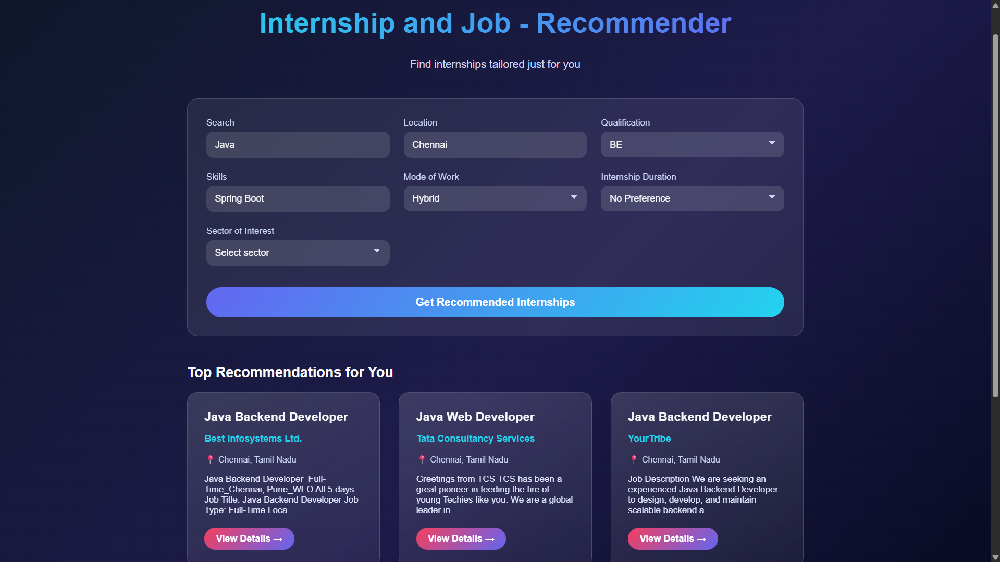

# 🌟 Internship Opportunity Discovery System

## 📌 Overview

The **Internship Opportunity Discovery System** is a smart web-based application designed to help students 🎓 and job seekers efficiently discover relevant internship opportunities based on their skills, interests, and career goals. The system leverages data analysis and recommendation techniques to deliver personalized internship suggestions, reducing manual effort and improving decision-making.

---

## 🎯 Objectives

* Help students find internships that match their skill sets
* Reduce time spent searching for opportunities manually
* Provide personalized and relevant internship recommendations
* Bridge the gap 🌉 between students and organizations

---

## 🚀 Features

* 🔍 **Skill-Based Recommendations** – Matches user skills with internship requirements
* 🤖 **Intelligent Recommendation Engine** – Uses text analysis and similarity matching
* 📄 **User Profile Management** – Skills, interests, and preferences
* 🗂️ **Intern/Admin Control** – Manage and update internship listings
* ⚡ **Fast & Efficient** – Optimized for quick recommendations

---

## 🛠️ Tech Stack

* **Backend:** Python / Flask
* **Machine Learning:** Scikit-learn (TF-IDF, similarity matching)
* **Database:** CSV / SQL (extendable)
* **API Testing:** Postman
* **Tools:** Git, GitHub

---

## 🧠 How It Works

1. User enters skills, interests, and preferences 🧩
2. Internship descriptions are processed using text vectorization 📊
3. Similarity scores are calculated 🤝
4. Top matching internships are recommended 📌

